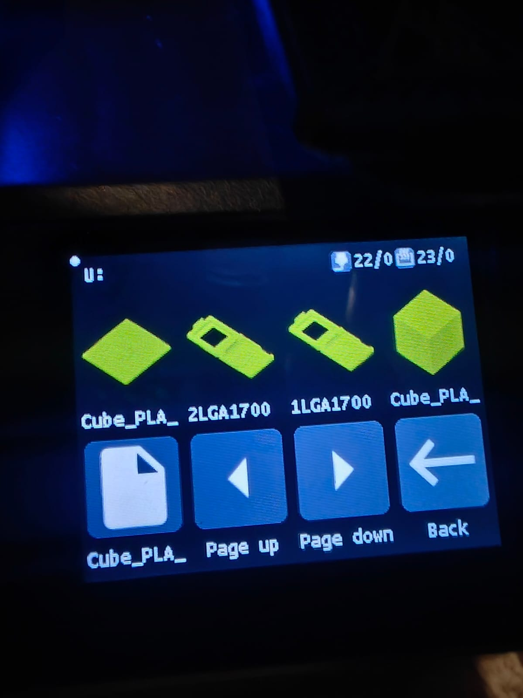
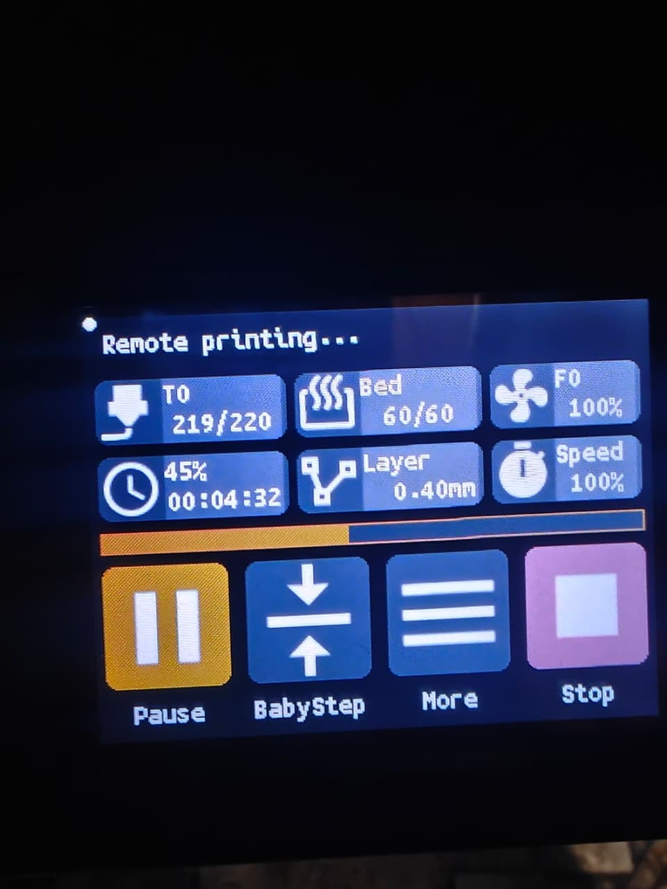
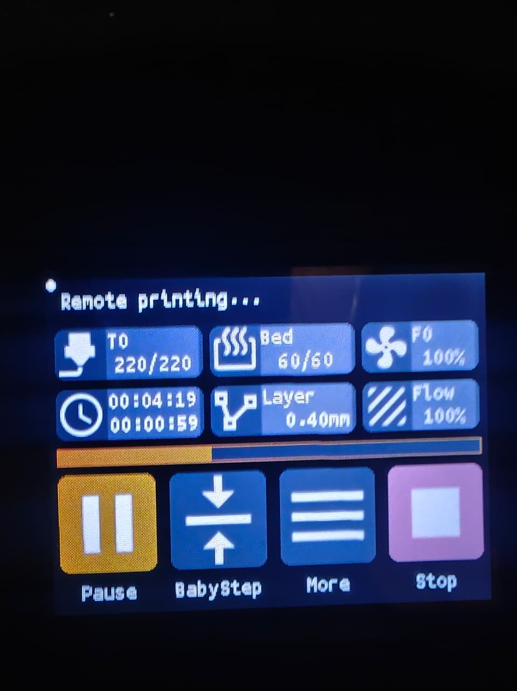
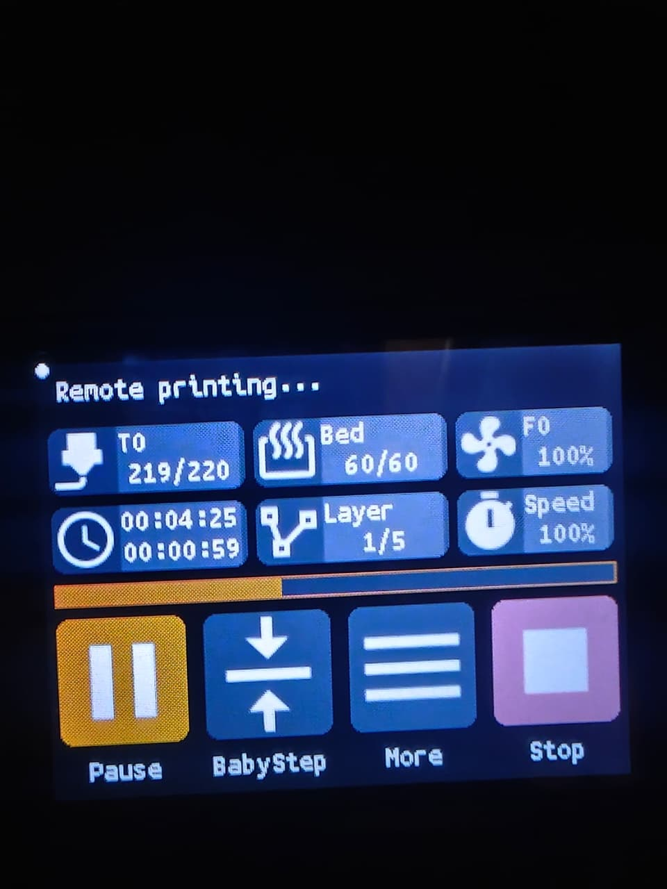

# BTT TFT Post-processor

[](https://github.com/persano/btt-tft-postprocess/actions/workflows/build-release.yml)
[](LICENSE)

If you print via a closed-source remote host — Mintion Beagle camera, ESP3D,
Pronterface, or anything else that isn't OctoPrint-with-the-BTT-plugin — your
BTT TFT touchscreen probably sits on its idle menu for the entire print. No
thumbnail, no time remaining, no progress bar. This script fixes that by
injecting the host-action commands directly into the sliced gcode file. The
TFT picks them up off the serial wire regardless of which host is streaming,
so you get the full printing screen without touching the host at all.

| Thumbnail | Progress % | Time left | Layers |
|:---------:|:----------:|:---------:|:------:|
|  |  |  |  |

---

## Does this apply to you?

- Your printer has a BTT TFT touchscreen running
  [BIGTREETECH TouchScreenFirmware](https://github.com/bigtreetech/BIGTREETECH-TouchScreenFirmware)
- Your printer runs Marlin firmware
- You slice with Orca Slicer or PrusaSlicer
- You print via a remote host that isn't OctoPrint (or OctoPrint without the
  BTT plugin)
- The TFT shows its idle screen during prints instead of the printing screen

If most of those are true, this is for you.

> If you use OctoPrint, the
> [BTT TFT Touchscreen Support plugin](https://plugins.octoprint.org/plugins/btt_tft_touchscreen/)
> is the cleaner solution — it sends the commands live without modifying gcode
> files.

---

## Install — 30 seconds, no Python required

1. Download `btt_postprocess.exe` from the
   [Releases page](../../releases/latest).
2. Save it somewhere permanent, e.g. `C:\Tools\btt_postprocess.exe`.
3. In Orca Slicer: **Print Settings → Others → Post-processing scripts**, add:

   ```
   "C:\Tools\btt_postprocess.exe";
   ```

Re-slice any file. Orca shows a log after slicing — you should see a line like:

```
[btt_postprocess] myfile.gcode: thumb=yes m73=47 m155=1 init_notif=1 end_notif=1
  cfg=610 feat=186 size=724844->495680 (-31.6%)
```

(Some counters omitted for brevity. The full schema is documented below.)

> **Windows Defender warning**: PyInstaller binaries sometimes trigger a
> SmartScreen warning on first run. This is a known false positive — the
> executable has no network code, no telemetry, and no update mechanism.
> Source is in this repo if you want to verify.

---

## Install — Python script (no .exe needed)

If you'd rather run the source directly:

1. Download `btt_postprocess.py` from the
   [Releases page](../../releases/latest) (or copy it from `src/` in this repo).
2. Save it anywhere permanent, e.g. `C:\Tools\btt_postprocess.py`.
3. Install Python 3.10+ (tick "Add to PATH" during setup) and run
   `pip install Pillow`.
4. In Orca: **Print Settings → Others → Post-processing scripts**:

   Windows:
   ```
   "C:\Python314\python.exe" "C:\Tools\btt_postprocess.py";
   ```

   macOS / Linux:
   ```
   /usr/bin/env python3 "/path/to/btt_postprocess.py";
   ```

Or install as a CLI tool:

```
pip install .
btt-postprocess /path/to/file.gcode
```

---

## What it does to your gcode

Every pass runs in one read/write cycle. After running you'll see a status
line in the slicer log:

```
[btt_postprocess] file.gcode: thumb=yes m73=113 m115=0 m104_fix=0 lc=1
  head_keys=2 m155=1 init_notif=1 end_notif=1 throttle=2 png=1 cfg=0
  feat=186 inline=38 minify=7 cmt_ws=98 ws=1 blanks=720 prior_btt=0
  size=724844->495680 (-31.6%)
```

The passes group into three categories:

### TFT feature support (content the TFT needs to display anything)

| Pass | What it does |
|---|---|
| BTT thumbnail conversion | Resizes the slicer's PNG to the four sizes BTT firmware expects (70×70, 95×80, 95×95, 160×140), converts each to RGB565 hex, prepends the result to the file. The TFT can't show a preview without this. |
| `M73` → `M118` notifications | After every `M73 P<%> R<minutes>` the slicer emits, injects `M118 P0 A1 action:notification Time Left HHhMMm00s` and `Data Left <%>/100`. These drive the TFT's time-left countdown and progress bar. |
| Inject `;LAYER_COUNT:N` | BTT TFT firmware and the Mintion Beagle web UI look for the PrusaSlicer/Cura canonical `;LAYER_COUNT:N` to populate their "X / N Layers" tile. Orca writes `; total layer number: N` instead, which neither parser recognizes (the total reads as 0 even though the data is in the file). The script reads N from Orca's line and inserts a sibling `;LAYER_COUNT:N` immediately after. Orca's original is preserved. |
| Duplicate trailer keys at the head | On large Orca slices (~75 MB+) Beagle's metadata scan times out before reaching the trailer summary and CONFIG_BLOCK at end-of-file, so the "X / N Layers" and model-height tiles read 0 even though every marker is in the file. The script copies `; total layers count = N` and `; layer_height = X` up to right after `; HEADER_BLOCK_END` so the head-scan finds them. Originals at end-of-file are preserved. |
| Start-of-print notification ordering | Slicer start gcode normally fires `M73` BEFORE `action:print_start`. The TFT only opens the print screen on `print_start`, so the initial "Time Left / Data Left" pair would be invisible. The script moves a fresh pair to immediately AFTER `print_start`. |
| End-of-print notification ordering | Slicer end gcode normally fires `action:print_end` BEFORE the final `M73 P100 R0`. The TFT dismisses the print screen on `print_end`, so the 100% / 00:00 state never shows. The script inserts a fresh "100/100, 00h00m00s" pair immediately BEFORE `print_end` and drops stale notifications on the wrong side of either anchor. |

### Beagle / Marlin compatibility (printer-side fixes)

| Pass | What it does |
|---|---|
| Strip `M115` | The firmware-info query has no effect on a print, but its multi-line response races with `M105` polls on hosts that proxy the serial line (Mintion Beagle, some ESP3D variants) and can overflow the host's RX buffer during startup. |
| `M104` → `M109` warmup fix | If the slicer's auto-generated header sets the nozzle with `M104` but never waits with `M109`, the print starts moving before the hotend reaches temperature. The script upgrades the final pre-print `M104 S>0` to `M109`. Works around OrcaSlicer issues [#2334](https://github.com/OrcaSlicer/OrcaSlicer/issues/2334) and [#4337](https://github.com/OrcaSlicer/OrcaSlicer/issues/4337). |
| Inject `M155 S30` | Marlin's default temperature auto-report interval is 5s. Raising it to 30s cuts serial traffic ~6x and is the other half of preventing Beagle buffer overflows. Skipped if your start gcode already manages `M155`. |
| Inject `M154 S0` at print start | The BTT TFT firmware enables Marlin's position auto-report (`M154 S1`) during its init handshake so it can drive the on-screen position display. On hosts that proxy the serial line (Mintion Beagle), the resulting 1 Hz X/Y/Z dump can pile onto temperature traffic and acks until the wire deadlocks mid-print — host retransmits indefinitely, no `ok` comes back. The script injects `M154 S0` immediately after `action:print_start` to disable the auto-reporter for the print body; explicit `M114` queries from the TFT/Beagle keep working. Also re-emits `M155 S<interval>` at the same anchor in case anything in start gcode reset it. |

### Size reduction (typically ~30% smaller files on Orca output)

| Pass | What it does |
|---|---|
| Strip PNG thumbnail block | The slicer's base64 PNG is dead weight once we've converted it. Handles `thumbnail`, `thumbnail_QOI`, `thumbnail_JPG` variants. |
| Strip Orca config block | Drops the full `; CONFIG_BLOCK_START … ; CONFIG_BLOCK_END` settings dump from the end of the file. ~30-60 KB. **Breaks Orca's "reload with config" feature** — disable if you rely on that (see Configuration below). |
| Strip slicer feature/metadata comments | `;TYPE:`, `;WIDTH:`, wipe/flush/object markers, Orca's THUMBNAIL/EXECUTABLE block delimiters, `; * extrusion width = *`, Klipper `;_SET_FAN_SPEED` hints, bare `;` separators. **Preserves the entire Orca `HEADER_BLOCK_START…HEADER_BLOCK_END` metadata block** — `; generated by …`, `; total layer number: N`, `; filament_density:`, `; filament_diameter:`, `; filament:`, `; max_z_height:` — because the Mintion Beagle web UI uses these to populate the model-height + current/total layer tiles. Also preserves `LAYER_CHANGE`/`LAYER_COUNT` and `;HEIGHT:`/`;Z:`. |
| Strip inline command comments | `G1 X10 ; whatever` → `G1 X10`. Comment-only lines and `M117`/`M118` display messages are left alone. |
| Minify float coordinates | `X100.000` → `X100`, `Z0.20` → `Z0.2`, `F1500.0` → `F1500`. Marlin parses floats so trailing-zero stripping is a behavioral no-op. |
| Strip leading whitespace on comments | `; foo` → `;foo`. No firmware reads the space-separated form differently. |
| Trim trailing whitespace | Removes trailing spaces/tabs on every line. |
| Collapse blank lines | Drops blank/whitespace-only lines. |

### Robustness

| Behavior | Why |
|---|---|
| Read/write with `newline=""` | Stops Python's Windows text-mode wrapper from translating already-CRLF strings to CRCRLF, which most editors render as blank lines between every injected line. |
| Heals `\r\r\n` on read | Files produced by previous buggy versions get cleaned automatically by re-processing. |
| Idempotent | Re-running the script on its own output is safe: prior BTT thumbnails are stripped before a fresh one is prepended, M73 notification injection skips if a notification already follows, and the start/end reorders detect and replace existing pairs instead of stacking. |

---

## Configuration

Every optional pass has a toggle at the top of
[`src/btt_postprocess.py`](src/btt_postprocess.py). All default to **on**.
Flip any flag to `False` and rebuild the `.exe` (or run the `.py`
directly) to opt out.

Two transforms are always-on because the script has no reason to exist
without them: the BTT thumbnail conversion (turn off thumbnails in the
slicer instead) and the M73 → M118 progress notifications. The newline /
CRCRLF handling is also always-on — it's a correctness fix.

### Beagle / Marlin compatibility

| Constant | Default | Effect |
|---|---|---|
| `ENABLE_STRIP_M115` | `True` | Strip `M115` firmware-info queries. Disable if you actually want their response for some reason. |
| `ENABLE_M104_TO_M109_WARMUP_FIX` | `True` | Upgrade the final pre-print `M104 S>0` to `M109` when the slicer's auto-header forgot to wait. Disable if your start gcode handles waits itself and you'd rather the script not touch them. |
| `ENABLE_INJECT_LAYER_COUNT_MARKER` | `True` | Inject `;LAYER_COUNT:N` alongside Orca's `; total layer number: N` so BTT firmware / Beagle web UI see the layer total. Disable if you're on a slicer that already emits `;LAYER_COUNT:` (PrusaSlicer, Cura — injection is a no-op there anyway). |
| `ENABLE_DUPLICATE_TRAILER_KEYS_AT_HEAD` | `True` | Copy `; total layers count = N` (Orca trailer) and `; layer_height = X` (Orca CONFIG_BLOCK) up next to `; HEADER_BLOCK_END`. On large Orca files (~75 MB+), those keys live tens of megabytes from end-of-file, past where Beagle's metadata scan reads. Without this, the "X / N Layers" and model-height tiles read 0 even though every marker is intact. Originals at end-of-file are preserved. |
| `M155_INTERVAL_SECONDS` | `30` | Seconds between Marlin's auto temperature reports. Lower = faster temp updates in the Beagle app, more serial traffic. Higher = less traffic, slower display. Set to `0` to skip injection entirely (printer keeps Marlin's 5s default). |
| `ENABLE_THROTTLE_AUTOREPORTS_AT_PRINT_START` | `False` | Right after `action:print_start`, re-emit `M154 S0` (disable Marlin position auto-reports) and `M155 S<interval>` (reassert temp auto-report rate). The BTT TFT firmware turns M154 S1 on during init; on hosts that proxy the serial line (Mintion Beagle) the resulting 1 Hz position stream can deadlock the protocol mid-print. **Default flipped off in v0.2.5** because the `M154 S0` injection broke SD-card prints on stock Artillery firmware (which doesn't compile in M154 support). Enable manually if you're on a Marlin build that supports M154 and want the Beagle mitigation. |

### TFT notification ordering

| Constant | Default | Effect |
|---|---|---|
| `ENABLE_REORDER_INIT_NOTIFICATIONS` | `True` | Move the initial 0% / total-time notification pair to immediately AFTER `action:print_start` so the TFT can see it. Disable if your start gcode uses a different action and you don't want any reordering. |
| `ENABLE_REORDER_FINAL_NOTIFICATIONS` | `True` | Move the final 100% / 00:00 pair to immediately BEFORE `action:print_end`. Disable if you don't use `action:print_end` in your end gcode. |

### Size reduction

| Constant | Default | Effect | Tradeoff |
|---|---|---|---|
| `ENABLE_STRIP_PNG_THUMBNAIL` | `True` | Drop the slicer's base64 PNG block after extraction. | Hosts that read the slicer PNG for previews (some web hosts; Mintion Beagle does NOT) lose their preview. |
| `ENABLE_STRIP_CONFIG_BLOCK` | `False` | Drop Orca's `; CONFIG_BLOCK_START ... ; CONFIG_BLOCK_END` settings dump. ~30-60 KB savings. **Default flipped off in v0.2.2** because the Mintion Beagle web UI reads `; layer_height = N` from inside the block to compute the layer-total tile; stripping the block kills that tile. Enable only if you don't use Beagle. | Beagle's "Layers X/N" tile reads 0, plus breaks Orca's "reload with config" feature. |
| `ENABLE_STRIP_FEATURE_COMMENTS` | `True` | Drop `;TYPE:`, `;WIDTH:`, wipe markers, extrusion-width annotations, Klipper `;_SET_FAN_SPEED` hints, bare `;` separators, and Orca's `THUMBNAIL_BLOCK` / `EXECUTABLE_BLOCK` delimiters. **Preserves the Orca `HEADER_BLOCK_START…HEADER_BLOCK_END` block (slicer-ID, filament metadata, layer/height totals)** because the Beagle parser needs it intact to populate the layer-total tile. Also preserves `LAYER_CHANGE`/`LAYER_COUNT` and `;HEIGHT:`/`;Z:`. | Lose per-segment annotations if you ever open the file. |
| `ENABLE_STRIP_INLINE_COMMENTS` | `True` | Trim `; comment` from the end of G/M lines. `M117`/`M118` messages untouched. | Same as above. |
| `ENABLE_MINIFY_FLOATS` | `True` | `X100.000` → `X100`, `Z0.20` → `Z0.2`. | None (behavioral no-op). |
| `ENABLE_STRIP_COMMENT_LEADING_WS` | `True` | `; foo` → `;foo`. | None (firmware doesn't care). |
| `ENABLE_STRIP_TRAILING_WS` | `True` | Trim trailing spaces/tabs from every line. | None. |
| `ENABLE_COLLAPSE_BLANK_LINES` | `True` | Drop blank lines. | None. |

### Thumbnail

| Constant | Default | Effect |
|---|---|---|
| `THUMBNAIL_SIZES` | `[(70,70), (95,80), (95,95), (160,140)]` | Sizes generated for the BTT TFT firmware. Don't change unless you know your firmware expects a different set. |

---

## Slicer setup checklist

The script needs the slicer to emit certain things. Check both:

| Setting | Location in Orca | Required value |
|---|---|---|
| G-code thumbnails | Printer Settings → Machine G-code | enabled (any size) |
| Disable set remaining print time | Printer Settings → Basic Info → Advanced | **unchecked** |

Also add these to your printer profile's Machine G-code if they aren't there:

```gcode
; Start G-code
M118 P0 A1 action:print_start

; End G-code
M118 P0 A1 action:cancel

; Pause G-code
M0

; Layer change G-code
M118 P0 A1 action:notification Layer Left [layer_num]/[total_layer_count]
```

> **Why `action:cancel` and not `action:print_end`?**
> When streaming from a host (no SD card involved), `action:print_end` triggers a
> "No SD card" popup on most BTT TFT firmware versions — the print-end code path
> tries to close an SD file that doesn't exist. `action:cancel` exits the printing
> screen cleanly; the only cosmetic downside is a brief "Print Aborted"
> notification. The print completed normally — the TFT just labels the screen-exit
> that way. If you find a firmware version where `action:print_end` works without
> the popup, [open an issue](../../issues).

See [docs/slicer-setup.md](docs/slicer-setup.md) for a step-by-step walkthrough
with screenshots for both Orca Slicer and PrusaSlicer.

---

## Known limitations

**App-initiated pause/resume/cancel.** If your host (e.g. Mintion Beagle)
doesn't send standard `M25`/`M24`/`M524` commands, the TFT's hardware buttons
and your app's pause button won't be linked. The Beagle uses its own park
sequence, so this is a Beagle firmware limitation — not something this script
can bridge.

**999-layer display cap.** Most BTT TFT firmware versions display at most 999
in the layer counter. Prints with more layers clip at 999 in the display but
print normally.

**`_btt` suffix on output file.** If your slicer sets `SLIC3R_PP_OUTPUT_NAME`
(Orca and PrusaSlicer both do), the post-processed file gets a `_btt` suffix.
This is intentional, matching the original BIQU script's behavior. If you
re-run the script on an already-processed file you'll get `_btt_btt` — re-slice
instead of running manually on existing files.

---

## Troubleshooting

**No thumbnail on the TFT.** Check the slicer log for `thumbnail=yes/no`. If
`no`, make sure G-code thumbnails are enabled in Printer Settings → Machine
G-code. Any thumbnail size works; the script resizes it.

**Progress bar / time left never update.** Open the sliced gcode in a text
editor and search for `M73`. If there are no hits, the slicer isn't emitting
them — uncheck "Disable set remaining print time" in Printer Settings → Basic
Information → Advanced.

**Slicer reports post-processing failed.** Run the script manually to see the
full error:

```
btt_postprocess.exe C:\path\to\file.gcode
```

or with Python:

```
python src\btt_postprocess.py C:\path\to\file.gcode
```

---

## Building the .exe yourself

```
pip install pyinstaller Pillow
build_exe.bat
```

Output: `dist\btt_postprocess.exe` (~15 MB, no Python required to run).

---

## Credits

The thumbnail conversion approach reimplements the logic from a script shared in
[BIGTREETECH-TouchScreenFirmware issue #1238](https://github.com/bigtreetech/BIGTREETECH-TouchScreenFirmware/issues/1238#issuecomment-728333398)
by the BIQU/BIGTREETECH community. The original used PyQt5; this script uses
Pillow instead, which produces a smaller executable and removes the Qt dependency.

---

## License

MIT — see [LICENSE](LICENSE).

## Contributing

See [CONTRIBUTING.md](CONTRIBUTING.md).

## Issues

[Open an issue](../../issues) for bugs or feature requests.
